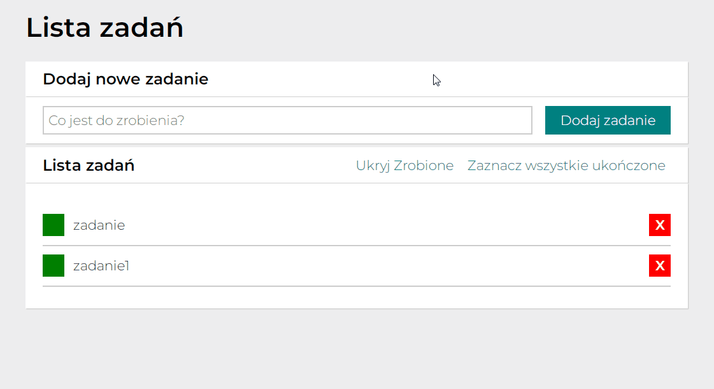

# Order list app ver. 2

## Website app address

[DEMO](https://gizmomochu.github.io/ListV2/)

## Description

It's a second version of ***"To-Do List"*** web application, which You can use the following functions:
- **"Dodaj zadanie"** new task,
- **"Usuń"** existing task,
- **"Zaznacz"** done task,

and new buttons added:
- **"Ukryj zrobione"** or **"Pokaż zrobione"**,
- **"Zakończ wszystkie ukończone"**.

## Used technologies

- ***HTML*** with using ***BEM*** convention,
- ***CSS*** with using ***FLEX*** and ***GRID*** layout,
- ***JAVA SCRIPT*** with using ***IMMUTABILITY***.